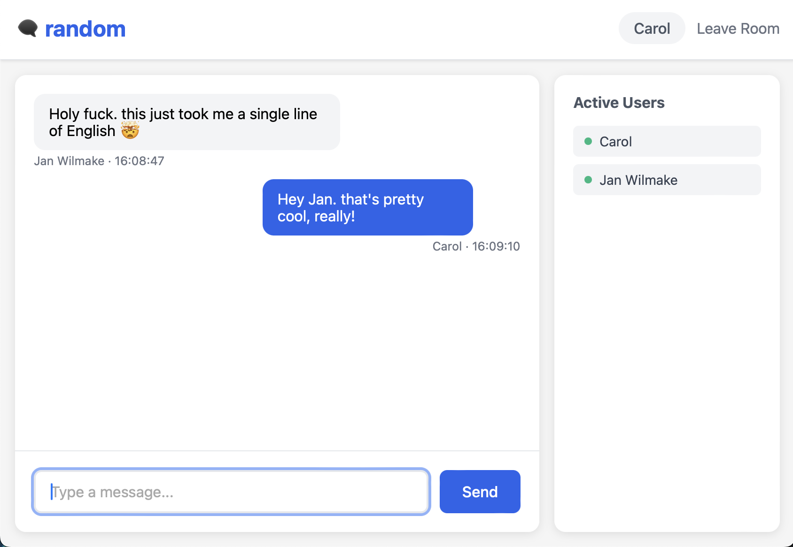

DORM is optimised for LLMs. This is how easy it is to build with it.

- context: https://github.com/janwilmake/dorm/blob/main/template.ts (±4000 tokens)
- prompt: `make me a new Cloudflare worker using dorm that is a chatroom app. each room is a db. the username can be created in the room itself when opening it in the browser.`
- LLM: claude 3.7
- result: https://chatroom.getdorm.com

